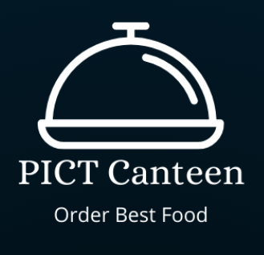

<div id="top"></div>


<!-- PROJECT LOGO -->
<br />
<div align="center">
  <h1>PICT Canteen</h1>
  
  <br/>
  <a href="https://github.com/othneildrew/Best-README-Template">
    
<!--     
    
     -->
  </a>


</div>


<!-- TABLE OF CONTENTS -->
<details>
  <summary>Table of Contents</summary>
  <ol>
    <li>
      <a href="#about-the-project">About The Project</a>
      <ul>
        <li><a href="#built-with">Built With</a></li>
      </ul>
    </li>
    <li>
      <a href="#getting-started">Getting Started</a>
      <ul>
        <li><a href="#prerequisites">Prerequisites</a></li>
        <li><a href="#installation">Installation</a></li>
      </ul>
    </li>
    
  </ol>
</details>


<!-- ABOUT THE PROJECT -->
## About The Project

Mini Project for Canteen Using MERN Stack Technology, where we can view or place the order

<p align="right">(<a href="#top">back to top</a>)</p>


### Built With

This section should list any major frameworks/libraries used to bootstrap your project. Leave any add-ons/plugins for the acknowledgements section. Here are a few examples.

* [React.js]
* [Node.js]
* [Express]
* [MongoDB]

<p align="right">(<a href="#top">back to top</a>)</p>


<!-- GETTING STARTED -->
## Getting Started

This is an example of how you may give instructions on setting up your project locally.
To get a local copy up and running follow these simple example steps.

### Prerequisites

This is an example of how to list things you need to use the software and how to install them.
* npm
  ```sh
  npm install npm@latest -g
  ```

### Installation

_Below is an example of how you can instruct your audience on installing and setting up your app. This template doesn't rely on any external dependencies or services._

1. Get a free API Key at [https://example.com](https://example.com)
2. Clone the repo
   ```sh
   git clone https://github.com/Charlie0560/PICT_Canteen.git
   ```
3. Install NPM packages for server-side/backend
   ```sh
   npm i
   npm init
   ```
4. Install NPM packages for client-side/frontend
   ```sh
   cd frontend
   npm i
   ```

<p align="right">(<a href="#top">back to top</a>)</p>


<!-- To run the project -->
## Run
open two termnials ds in the current directory
 
 here common directory is named as "api"

1. To run client-side/frontend
   ```sh
   cd frontend
   npm start
   ```
2. To run server-side/backend (in another terminal)
   ```sh
   npm start
   ```
   

<p align="right">(<a href="#top">back to top</a>)</p>


